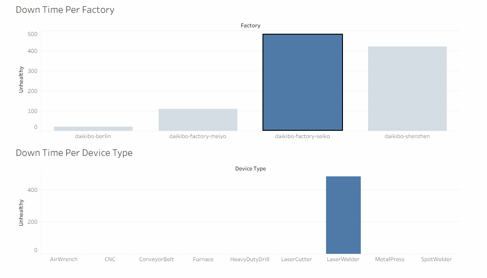

# Deloitte Data Analytics Virtual Job Simulation (Forage)

## Overview

This repository contains my completed work for the **Deloitte Data Analytics Virtual Job Simulation** on **Forage**. The simulation involved solving real-world business problems using **Tableau** and **Microsoft Excel**, focusing on data visualization, dashboard development, and forensic data analysis.

---

## Dashboard Preview



---

## Project Tasks

### 📊 Task 1 – Data Analysis

#### Objective

Analyze machine telemetry data collected from multiple manufacturing factories to identify downtime patterns and build an interactive dashboard.

#### Tools Used

- Tableau
- JSON Dataset

#### Work Completed

- Imported JSON telemetry data into Tableau
- Created a calculated field (**Unhealthy**) to measure machine downtime
- Built an interactive dashboard
- Visualized:
  - Down Time per Factory
  - Down Time per Device Type
- Applied dashboard filters for factory-level analysis

#### Deliverable

Interactive Tableau Dashboard

---

### 📈 Task 2 – Forensic Technology

#### Objective

Investigate employee gender pay equality using Equality Scores and classify each record based on predefined business rules.

#### Tools Used

- Microsoft Excel

#### Work Completed

- Created an **Equality Class** column
- Classified equality scores into:
  - Fair
  - Unfair
  - Highly Discriminative
- Automated classification using Excel logical functions

#### Formula Used

```excel
=IF(ABS(C2)<=10,"Fair",IF(ABS(C2)>20,"Highly Discriminative","Unfair"))
```

---

## Skills Demonstrated

- Data Analytics
- Data Visualization
- Dashboard Development
- Tableau
- Microsoft Excel
- Business Analysis
- Data Interpretation
- Calculated Fields
- Interactive Dashboards
- Excel IF Functions
- Forensic Data Analysis

---

## Technologies Used

- Tableau
- Microsoft Excel
- JSON
- Data Visualization
- Dashboard Design
- Data Analytics

---

## Repository Structure

```text
deloitte-data-analytics-job-simulation
│
├── README.md
├── Tableau/
│   ├── Dashboard.png
│   └── Dashboard.twb
│
├── Excel/
│   └── Equality_Table.xlsx
│
└── Certificate/
    └── Deloitte_Forage_Certificate.pdf
```

---

## Key Learning Outcomes

- Built interactive dashboards using Tableau.
- Analyzed operational telemetry data to identify downtime trends.
- Applied Excel formulas to classify business data efficiently.
- Improved analytical thinking by solving realistic business problems.
- Gained practical experience with data visualization and forensic analytics.

---

## About Me

I am an aspiring **Data Analyst** passionate about transforming raw data into meaningful insights through analytics and visualization.

### Technical Skills

- SQL
- Python
- Microsoft Excel
- Tableau
- Power BI
- Pandas
- NumPy

---

## Certificate

Successfully completed the **Deloitte Data Analytics Virtual Job Simulation** offered by **Forage**.

The completion certificate is available in the **Certificate** folder of this repository.

---

## Acknowledgement

This project was completed as part of the **Deloitte Data Analytics Virtual Job Simulation** provided by **Forage**. The simulation offers practical exposure to real-world data analytics, dashboard development, and business problem-solving.

---
